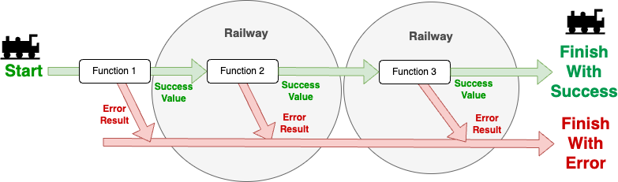
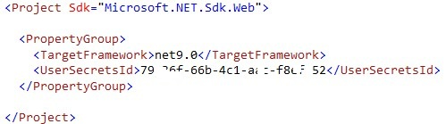

# EventSourcingSample

A sample of Event Sourcing that writes events to a MongoDB Collection with .NET Core 8.

In this sample, the implementation of an Ordering system allows to create an order, mark the order as paid or dispatched, and finally complete the order. The data and status of an order can be consulted at any time. The different events are stored in a MongoDB collection.

This repo includes:

- API REST with .NET Core 8.
- Event Sourcing in conjunction with MongoDB to store the events.
- Vertical Slice mixed with Clean Architecture.
- CQRS to separate reads and writes.
- Railway Oriented Programming (ROP).
- Secret Storage to store the connection string to MongoDB.

## Event Sourcing

Event Sourcing is a software architectural pattern that stores the state of an application as a sequence of events. Instead of persisting the current state of an object, Event Sourcing captures all changes to the object as a series of events. This allows for a complete history of changes, enabling features like auditing, time travel, and more.

### The Aggregate

In the context of Event Sourcing, an Aggregate is a cluster of domain objects that can be treated as a single unit. An Aggregate is responsible for enforcing invariants and encapsulating the business logic related to its state. It typically consists of an Aggregate Root and one or more child entities or value objects.

In our sample, the Aggregate is the type that we are going to use to realize all the logic of our object. This `Aggregate` type contains the list of `events`, the `Id`, and the current “`version`”, i.e. the number of events.

Finally, some logic is included to know when an element is a change coming from the database or is a new change to be stored:

```csharp
public abstract class Aggregate
{
    private List<AggregateChange> _changes = [];

    public Guid Id { get; internal set; }
    public int Version { get; set; } = 0;

    /// <summary>
    /// This flag is used to identify when an event is being loaded from the DB
    /// or when the event is being created as new
    /// </summary>
    private bool ReadingFromHistory { get; set; } = false;

    protected Aggregate(Guid id)
    {
        Id = id;
    }

    internal void Initialize(Guid id)
    {
        Id = id;
        _changes = [];
    }

    public IList<AggregateChange> GetUncommittedChanges()
    {
        return [.. _changes.Where(a => a.IsNew)];
    }

    public void MarkChangesAsCommitted()
    {
        _changes.Clear();
    }

    protected void ApplyChange<T>(T eventObject)
    {
        ArgumentNullException.ThrowIfNull(eventObject, nameof(eventObject));

        Version++;

        AggregateChange change = new AggregateChange(
            eventObject,
            Id,
            eventObject.GetType(),
            $"{Id}:{Version}",
            Version,
            ReadingFromHistory != true
        );
        _changes.Add(change);

    }

    public void LoadFromHistory(IList<AggregateChange> history)
    {
        if (!history.Any())
        {
            return;
        }

        ReadingFromHistory = true;
        foreach (var e in history)
        {
            ApplyChanges(e.Content);
        }
        ReadingFromHistory = false;

        Version = history.Last().Version;

        void ApplyChanges<TEvent>(TEvent eventObject)
        {
            this.AsDynamic()!.Apply(eventObject);
        }
    }
}
```

When a domain object is created in your domain, **you must implement Aggregate** so that it works as an aggregate, and use the `IApply<T>` interface for each event that the object will work with:
```csharp
public class Order : Aggregate, IApply<OrderCreated>, IApply<OrderPaid>, IApply<OrderDispatched>, IApply<OrderCompleted>
{
    public Order(Guid id) : base(id)
    {
    }
    public void Apply(OrderCreated @event)
    {
        // Logic to apply the event
    }
    public void Apply(OrderPaid @event)
    {
        // Logic to apply the event
    }
    public void Apply(OrderDispatched @event)
    {
        // Logic to apply the event
    }
    public void Apply(OrderCompleted @event)
    {
        // Logic to apply the event
    }
}
```

As we can see in the example, we have the aggregate `OrderDetails`, and then an `IApply<T>` for each event shown above.

### Save the Aggregate

When we store information we do it in a special way, since we do not store only the event, but we store information that makes it possible to identify it or group it together with others.

That information is what you can see in the `AggregateChange` and `AggregateChangeDto` types, this type contains information such as:

- `Content`: for the contents of the object (includes the event).
- `AggregateId`: Aggregate ID, in our case, the order ID.
- `AggregateType`: to know what type it is.
- `Version`: version of the aggregate, each new event adds 1 to the version number.
- `TransactionId`: combination between the Id and the version.

The `AggregateRepository<TAggregate>` class contains two methods and must be implemented by each repository:

- `GetByIdAsync`: Reads from the database by ID and assembles the Aggregate in order and correctly.
- `SaveAsync`: Saves the new events in the database.

This allows to inject `IAggregateRepository<TAggregate>` directly into the services / command handler, or create your own repository and implement `AggregateRepository<TAggregate>` (as a recommended option):

```csharp
public interface IOrderRepository
{
    Task<OrderDetails?> GetById(Guid id, CancellationToken cancellationToken = default);

    Task Save(OrderDetails orderDetails, CancellationToken cancellationToken = default);
}

public class OrderRepository(IEventStore eventStore) : AggregateRepository<OrderDetails>(eventStore), IOrderRepository
{
    public async Task<OrderDetails?> GetById(Guid id, CancellationToken cancellationToken = default)
        => await GetByIdAsync(id, cancellationToken);

    public async Task Save(OrderDetails orderDetails, CancellationToken cancellationToken = default)
        => await SaveAsync(orderDetails, cancellationToken);
}
```

A fairly simple implementation.

### Creating an Aggregate

In our sample, we have the `OrderDetails` aggregate, which is the one that will be used to create the order:

```csharp
public class OrderDetails : Aggregate, IApply<OrderCreated>
{
    public DeliveryDetails Delivery { get; private set; } = default!;
    public PaymentInformation PaymentInformation { get; private set; } = default!;
    public ImmutableArray<ProductQuantity> Products { get; private set; } = [];
    public OrderStatus Status { get; private set; }

    public OrderDetails(Guid id) : base(id)
    {
    }

    public void Apply(OrderCreated ev)
    {
        Delivery = ev.Delivery;
        PaymentInformation = ev.PaymentInformation;
        Products = [.. ev.Products];
        Status = OrderStatus.Created;
        ApplyChange(ev);
    }
}
```

When implementing the interface, we create a method called `Apply` that receives the event. Inside the method, we modify the object at will and call the `ApplyChange` method, which will store the event as a new event. Finally, when we save the aggregate through `AggregateRepository`, it will detect that it is a new event and save it.

As we have implemente additional use cases, we can repeat the same process for each even:

```csharp
public class OrderDetails : Aggregate, IApply<OrderCreated>, IApply<OrderPaid>, IApply<OrderDispatched>, IApply<OrderCompleted>
{
    public DeliveryDetails Delivery { get; private set; } = default!;
    public PaymentInformation PaymentInformation { get; private set; } = default!;
    public ImmutableArray<ProductQuantity> Products { get; private set; } = [];
    public OrderStatus Status { get; private set; }

    public OrderDetails(Guid id) : base(id)
    {
    }

    public void Apply(OrderCreated ev)
    {
        Delivery = ev.Delivery;
        PaymentInformation = ev.PaymentInformation;
        Products = [.. ev.Products];
        Status = OrderStatus.Created;
        ApplyChange(ev);
    }

    public void Apply(OrderPaid ev)
    {
        Status = OrderStatus.Paid;
        ApplyChange(ev);
    }

    public void Apply(OrderDispatched ev)
    {
        Status = OrderStatus.Dispatched;
        ApplyChange(ev);
    }

    public void Apply(OrderCompleted ev)
    {
        Status = OrderStatus.Completed;
        ApplyChange(ev);
    }
}
```

## Railway Oriented Programming

Railway Oriented Programming (ROP) is a functional programming pattern that facilitates error handling and is often used in languages that support functional programming concepts, like F#, Haskell, and others. The analogy of a railway is used to describe the flow of data through a series of functions, similar to how a train travels along tracks.


### Result pattern

The Result pattern (`Result<T>`) is a key concept in ROP. It typically allows to represent the outcome of a function as either a `Success` or a `Failure`, enabling to chain operations together while handling errors gracefully. This pattern is particularly useful in scenarios where you want to avoid throwing exceptions for control flow and instead use a more functional approach to error handling.



With ROP, the Result pattern and functional programming techniques, developing a program is like following the steps of a recipe, where the output of a previous step is the input for the next step.

### ROP benefits

Some of the benefits using ROP pattern are:

- **Improved readability:** The code clearly shows the flow of operations and potential failure points, making it easier to understand and maintain.
- **Improved error handling:** Error handling is comprehensive and consistent throughout the entire process.
- **Avoiding exceptions for control flow:** It is slow to "throw and catch", it is faster to return as Result.
- **Maintainability:** New steps can be easily added to the reservation process by extending the railway chain.
- **Testability:** Each operation is isolated and can be tested independently, while the entire flow can be tested as a unit.

### ROP in the sample

Here we implemented a simple example of how ROP and the Result pattern can be used in C#:

- `EventSourcingSample.ROP`: Implementation of the `Result<T>` structure.
- `EventSourcingSample.WebAPI`: In the ROP dolder, Api Extensions providing `ToActionResult<T>` that converts `Result<T>` into `IActionResult`.

Below, we can see how the ROP is implemented in the `CreateOrder` use case. The use of the ROP pattern is centered on the `Handler()` method:

```csharp
public sealed class CreateOrder
{
    public record CreateOrderRequest(DeliveryDetails DeliveryDetails, PaymentInformation PaymentInformation, IEnumerable<ProductQuantity> Products);

    public record CreateOrderResponse(Guid OrderId, string Location);

    public interface ICreateOrderHandler
    {
        Task<Result<CreateOrderResponse>> Handle(CreateOrderRequest createOrder, CancellationToken cancellationToken = default);
    }

    public class CreateOrderHandler : ICreateOrderHandler
    {
        private readonly IOrderRepository _orderRepository;

        public CreateOrderHandler(IOrderRepository orderRepository)
        {
            _orderRepository = orderRepository;
        }

        public async Task<Result<CreateOrderResponse>> Handle(CreateOrderRequest createOrder, CancellationToken cancellationToken = default)
        {
            return await CreateOrder(createOrder)
                .Async()
                .Bind(x => SaveOrder(x, cancellationToken))
                .Bind(x => MapToOrderResponse(x))
                .Map(x => new CreateOrderResponse(x.OrderId, $"order/getorderstatus/{x.OrderId}"));
        }

        private static Result<OrderDetails> CreateOrder(CreateOrderRequest createOrder)
        {
            Guid createdOrderId = Guid.NewGuid();

            var orderDetails = new OrderDetails(createdOrderId);
            orderDetails.Apply(new OrderCreated(createOrder.DeliveryDetails, createOrder.PaymentInformation, createOrder.Products));

            return orderDetails;
        }

        private async Task<Result<OrderDetails>> SaveOrder(OrderDetails orderDetails, CancellationToken cancellationToken)
        {
            await _orderRepository.Save(orderDetails, cancellationToken);
            return orderDetails;
        }

        private static Result<GetOrderResponse> MapToOrderResponse(OrderDetails orderDetails)
        {
            var products = orderDetails.Products
                .Select(p => new ProductQuantityName(p.ProductId, p.Quantity, $"Product {p.ProductId}"));           

            var orderResponse = new GetOrderResponse(orderDetails.Id, orderDetails.Status.ToString(),
                orderDetails.Delivery, orderDetails.PaymentInformation, products);
            return orderResponse;
        }
    }
}
```

## MongoDB

This sample uses MongoDB as the event store. MongoDB is a NoSQL database that stores data in a flexible, JSON-like format. It is well-suited for Event Sourcing due to its ability to handle large volumes of data and its support for complex queries.

In the `appsettings.json` file, we have the Database and Collection names used in MongoDB:

```json
{
  "EventSourcing": {
    "DatabaseName": "EventSourcingSample",
    "CollectionName": "EventsOrders"
  }
}
```

All the Event Sourcing logic is in the `EventSourcingSample.EventSourcing` project which is linked to MongoBD.

The dependency container has registered the `IEventStore` interface, which is the one that will be used in the `Aggregate` and which communicates with MongoDb through the `MongoEventStoreManager` class.

When saving the `AggregateChangeDto` information, we create an index in MongoDb with the Id (`AggregateId`), type (`AggregateType`) and version (`Version`) automatically.

## Secret Storage

The Secret Manager tool was used to store the connection string to MongoDB. This allows to keep sensitive information out of the source code and provides a way to manage secrets in a secure manner during development.

## Enable secret storage

The Secret Manager tool operates on project-specific configuration settings stored in the user profile.

To use user secrets in an existing project, you need to enable it. You can do this by running the following command in the project directory:

```bash
dotnet user-secrets init
```

This command adds a `UserSecretsId` element within a `PropertyGroup` of the project file, which is used to identify the secrets for this project:



> [!NOTE]
> The `EventSourcingSample.WebAPI` project already has the `UserSecretsId` element in the project file. If you create a new project, you can add this element manually or use the `dotnet user-secrets init` command to generate it automatically.

## Set a secret

Define an app secret consisting of a key and its value. The secret is associated with the project's `UserSecretsId` value. So, run the following command from the `EventSourcingSample.WebAPI` directory to add your own connection string to MongoDB:

```bash
dotnet user-secrets set "MongoDb:ConnectionString" "mongodb+srv://<username>:<db_password>@<server>:<port>" 
```

This configuration setting is used in the `MongoDbConnectionProvider` class in order to establish a connection to the MongoDB database. Thus, the connection string is retrieved from the secret storage at runtime.

## List the secrets

Run the following command from the directory in which the project file exists:

```bash
dotnet user-secrets list
```

## Remove a single secret

In case the secret needs to be removed, run the following command from the directory in which the project file exists:
```bash
dotnet user-secrets remove "MongoDb:ConnectionString"
```
